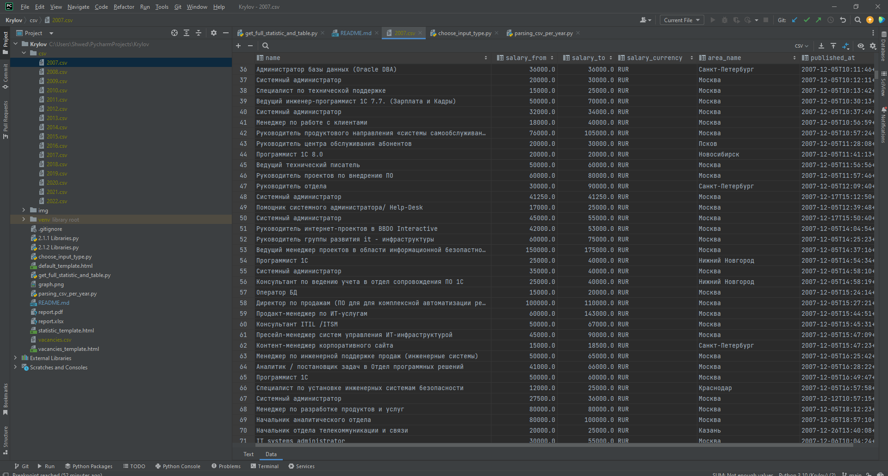
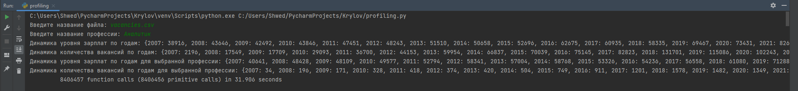
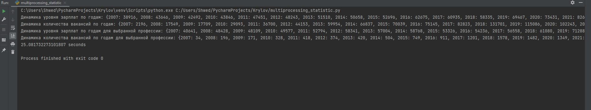
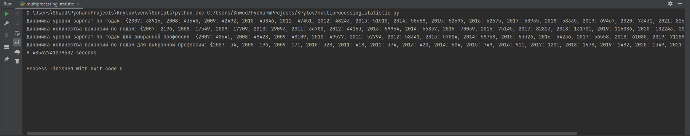
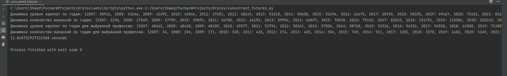
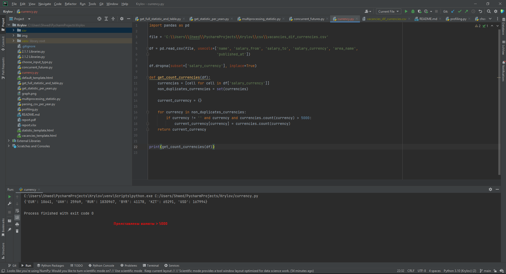
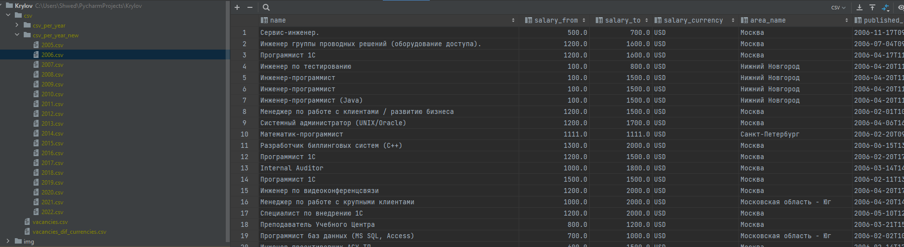

# Krylov
## Задание 2.3.3

Время обработки 1 функции

Время обработки 2 функции

Время обработки 3 функции

3 Функции

Решил оставить 3 функцию, как и было, но не выносить её в отдельную функцию, а использовать как значение.

## Задание 3.2.1

Внутренность и колличество csv файлов

## Задание 3.2.2

Время работы без мультипроцессинга

Время работы с мультипроцессингом

## Задание 3.2.3

Время работы с мультипроцессингом

Время работы с Current Future

Дальнейшую работу будем осуществлять с помощью мультипроцессинга

## Задание 3.3.1

Частотность вакансий с валютами > 5000

Внутренность и колличество csv файлов

